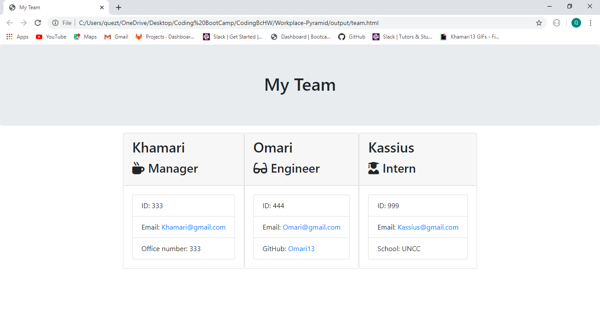

# Workplace Pyramid

## Description: This app is useful for business owners who want to keep track of their employees from top to bottom. It ask a number of questions for each selection (Manager, Engineer, or Intern) they all have base questions such as name, email, and id. They also have a seperate question or two that is specific for the given employee. Once you answer all the required questions the app will generate a html page that gives you the information entered into a set of cards that displays all input information

